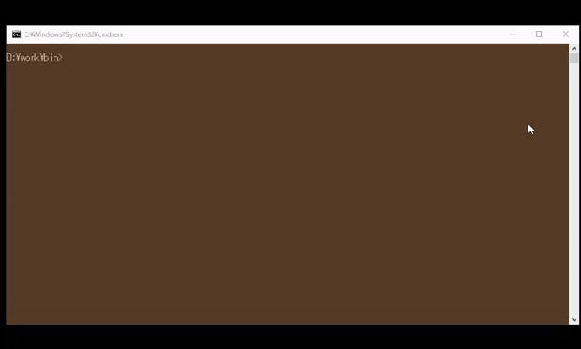
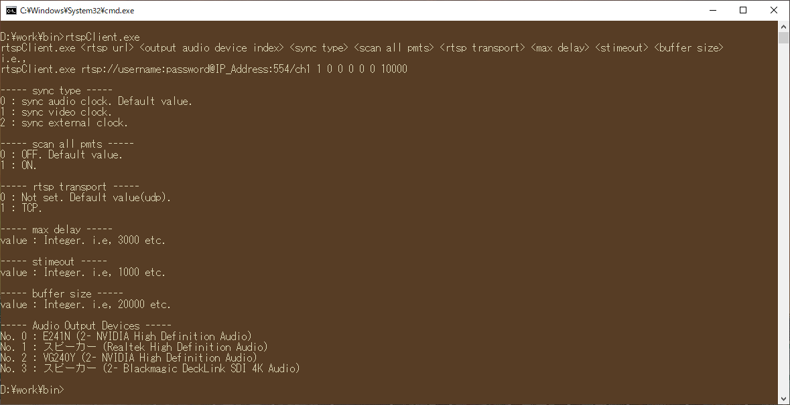

# RTSP Client

## Introduction

RTSP client using SDL2 and ffmpeg 6.0.  

## Demo

  


## Verified PTZ Cameras

    - Tapo c200  
    - JENNOV P31  

## Dependency

    - SDL2 2.28.5+  
    - FFMPEG 6.0+  

## Setup

### For Windows

#### SDL2

1. Download the SDL2 from below URL.  
[https://www.libsdl.org/](https://www.libsdl.org/)  

2. Place it anywhere you wish.  


#### FFMPEG

1. Download the FFMPEG from below URL.  
[https://ffmpeg.org/download.html](https://ffmpeg.org/download.html)  

2. Place it anywhere you wish.  


### For Ubuntu

#### SDL2

Install to libsdl2-dev.  
Please run to below command.  

``` shell
sudo apt install libsdl2-dev  
sudo apt install libsdl2-image-dev libsdl2-mixer-dev libsdl2-net-dev libsdl2-ttf-dev  
```

#### FFMPEG

NOTE: https://ubuntuhandbook.org/index.php/2023/03/ffmpeg-6-0-released-how-to-install-in-ubuntu-22-04-20-04/  

FFMPEG 6.0 or later must be installed.  
Follow the steps below to install from PPA.  

1. Add a ffmpeg 6.0 PPA.  

``` shell
sudo add-apt-repository ppa:ubuntuhandbook1/ffmpeg6
```

2. Update.  

``` shell
sudo apt update
```

3. Install ffmpeg 6.0.  

``` shell
sudo apt install ffmpeg
```

4. Check for installable 'libav...'.  

``` shell
apt policy libavcodec-dev libavfilter-dev libavformat-dev libavutil-dev libavdevice-dev libswscale-dev libswresample-dev  
```

The following output would be obtained.  
[Installed:] is already installed.  

<pre>
libavcodec-dev:
  Installed: 7:6.0-1build8~22.04
  Candidate: 7:6.0-1build8~22.04
  Version table:
 *** 7:6.0-1build8~22.04 500
        500 https://ppa.launchpadcontent.net/ubuntuhandbook1/ffmpeg6/ubuntu jammy/main amd64 Packages
        100 /var/lib/dpkg/status
     7:6.0-0ubuntu1~22.04.sav2 500
        500 https://ppa.launchpadcontent.net/savoury1/ffmpeg6/ubuntu jammy/main amd64 Packages
     7:4.4.4-0ubuntu1~22.04.sav1 500
        500 https://ppa.launchpadcontent.net/savoury1/ffmpeg4/ubuntu jammy/main amd64 Packages
     7:4.4.2-0ubuntu0.22.04.1 500
        500 http://archive.ubuntu.com/ubuntu jammy-updates/universe amd64 Packages
        500 http://security.ubuntu.com/ubuntu jammy-security/universe amd64 Packages
     7:4.4.1-3ubuntu5 500
        500 http://archive.ubuntu.com/ubuntu jammy/universe amd64 Packages
</pre>

5. Install the required version.  
Only three are specified, but the other libav... are dependencies and will be installed on their own.  

``` shell
sudo apt install libavformat-dev=7:6.0-1build8~22.04 libavfilter-dev=7:6.0-1build8~22.04 libavdevice-dev=7:6.0-1build8~22.04  
```

6. Confirm that everything has been installed.  

``` shell
apt policy libavcodec-dev libavfilter-dev libavformat-dev libavutil-dev libavdevice-dev libswscale-dev libswresample-dev  
```

## Build

### For Windows

Ninja + LLVM 16.0  
powershell.exe cmake -S . -B build -G "\"Ninja Multi-Config"\" -D FFMPEG_PATH="/path/to/ffmpeg" -D SDL2_PATH="/path/to/sdl2"  

``` shell
cd src  
powershell.exe cmake -S . -B build -G "\"Ninja Multi-Config\"" -D FFMPEG_PATH="C:\software\ffmpeg-n6.0-latest-win64-lgpl-shared-6.0" -D SDL2_PATH="C:\software\SDL2-2.28.5" -D LIVE555_PATH="C:\software\live555_shared_win64_manual" -D OPENSSL_PATH="C:\software\OpenSSL-Win64"  
powershell.exe cmake --build build  
```

MSVC(Default)  

``` shell
cd src
powershell.exe cmake -S . -B build  
powershell.exe cmake --build build  
```

### For Ubuntu(22.04 LTS)

GCC 11.4.0(Ubuntu 11.4.0-1ubuntu1~22.04)

``` shell
cd src  
cmake -S . -B build  
cmake --build build  
```

## How to use

1. Build this repository.  
2. Run the generated binary from the console.  
i.e, build/Debug/rtspClient.exe rtsp://username:password/IP_ADDRESS:554/stream 0

## Options

Options are available for this software according to several arguments.  
The following parameters are available.  



### sync type

    Specify the clock to be used for synchronization.  
    0 : sync audio clock. Default value.  
    1 : sync video clock.  
    2 : sync external clock.  

### scan all pmts

    This is an option primarily related to streaming MPEG-TS and reading files.  
    When enabled, all PMTs are scanned, not just the first PMT.  
    For MPEG-TS with multiple PMTs, all stream information can be retrieved.  

    0 : OFF. Default value.  
    1 : ON.  

### rtsp transport

    This sets the receive protocol for the RTSP stream.  

    0 : Not set. Default value(udp).  
    1 : TCP.  

### max delay

    Sets the maximum delay time.  
    The unit is us.  

### stimeout

    Set timeout (in microseconds) of socket TCP I/O operations.  

### buffer size

    Underlying protocol send/receive buffer size.  


